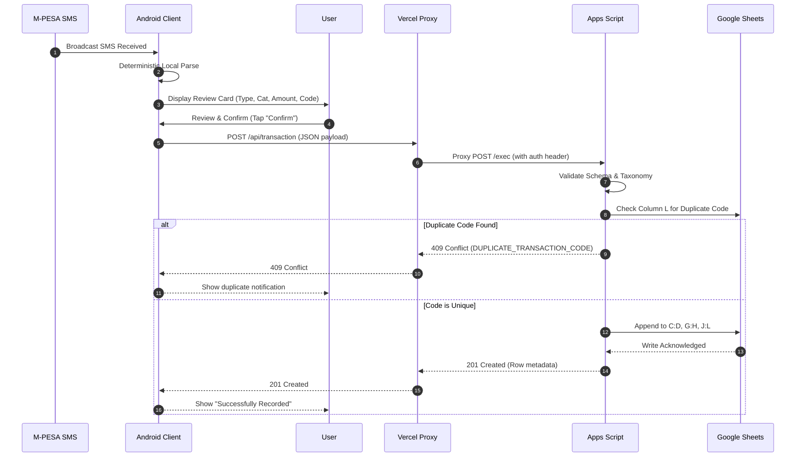

# System Architecture & Design Boundaries

## 1. Architectural Principles

GMDParser enforces strict architectural separation of concerns. Every layer has non-overlapping responsibilities and rigid boundaries:

```
[ Android Client ]
       │  (HTTPS - Confirmed Transactions Only)
       ▼
[ Vercel API Gateway ]
       │  (HTTPS Proxy with Shared Secret Auth)
       ▼
[ Google Apps Script ]
       │  (Google Sheets API / SpreadsheetApp Service)
       ▼
[ Google Sheets Financial Model ]
```

---

## 2. Layer Responsibilities & Isolation

### 2.1 Android Application (`android/`)
* **Role**: Client interface, event listener, and local interpretation engine.
* **Responsibilities**:
  - Intercepts incoming SMS broadcasts matching M-PESA sender signatures (`MPESA`).
  - Executes local, deterministic pattern parsing to extract transaction parameters.
  - Presents an interactive review card to the user containing the interpreted transaction.
  - Permits manual edits for classification corrections (type, category, account, destination).
  - **Mandatory User Confirmation**: Requires active user action (e.g., tap "Confirm & Record") prior to network transmission.
  - Sends confirmed payloads to the Vercel API gateway.
* **Strict Constraints**:
  - `isAutoSync()` must evaluate to `false` at all times.
  - Never directly communicates with Google Sheets or Apps Script.
  - Never stores or embeds Google service account keys, Apps Script secrets, or Sheet IDs.
  - Never silently executes background financial writes.

### 2.2 Vercel API Layer (`web/`)
* **Role**: Public network ingress and routing proxy.
* **Domain**: `https://gmdparser.vercel.app`
* **Responsibilities**:
  - Exposes standardized public endpoints:
    - `/api/health`
    - `/api/transaction`
    - `/api/taxonomy`
  - Normalizes headers, handles TLS termination, and provides network stability across diverse mobile carriers (Safaricom, Airtel, WiFi).
  - Forwards requests to the Google Apps Script Web App execution endpoint via server-side HTTP POST.
* **Strict Constraints**:
  - **Stateless**: Does not maintain an independent database (PostgreSQL, MongoDB, Redis, etc.) for financial ledgers.
  - Never acts as an authoritative source of truth.
  - Rejects malformed JSON requests before forwarding.

### 2.3 Google Apps Script Backend (`apps-script/`)
* **Role**: Controlled backend, validation authority, and transaction writer.
* **Responsibilities**:
  - Receives proxied payloads from the Vercel API gateway.
  - Authenticates the request via a shared API secret header/token.
  - **Payload Validation**: Validates date formats, positive non-zero amounts, transaction code format, and required fields.
  - **Taxonomy Validation**: Verifies that `type`, `category`, and `account` exist within the active spreadsheet validation lists.
  - **Duplicate Check (Idempotency)**: Scans column `L` (Transaction Code) of the `Transactions` sheet. If the code exists, rejects the write with a structured `DUPLICATE_TRANSACTION_CODE` response.
  - **Bounded Cell Write**: Calculates the next available row index and appends strictly to allowed column ranges:
    - `C:D` (Date, Type)
    - `G:H` (Category, Description)
    - `J:L` (Amount, Account, Transaction Code)
  - Returns structured JSON responses (`success: true`, transaction details, row index, timestamp).
* **Strict Constraints**:
  - Never blindly trusts Android input.
  - Never overwrites formula columns (`A:B`, `E:F`, `I`, `P:BR`).
  - Never clears, truncates, or resets the sheet.
  - Fails safely on any error without mutating existing rows.

### 2.4 Google Sheets Financial Model
* **Role**: Authoritative financial repository, ledger, and reporting engine.
* **Responsibilities**:
  - Maintains historical transactions.
  - Computes running balances, category spending totals, budget comparisons, and cashflow charts through built-in formulas.
  - Defines the authoritative category lists and account taxonomy via setup sheets.
* **Strict Constraints**:
  - Protected against wholesale row deletion, programmatic sheet recreation, or column shifts.

---

## 3. Data Flow Progression



---

## 4. Fail-Safe Architectural Guarantees

1. **Idempotent Writes**: The M-PESA transaction code (10-character alphanumeric string e.g., `TD47XYZ123`) is the primary idempotency key.
2. **Transfer Integrity**: Transfers require both `account` (source) and `destinationAccount`. If `destinationAccount` is missing on a transfer type, the backend rejects it; it is never silently downgraded into an expense.
3. **No Phantom Updates**: Read-only columns and spreadsheet formulas are never touched by the write script.
