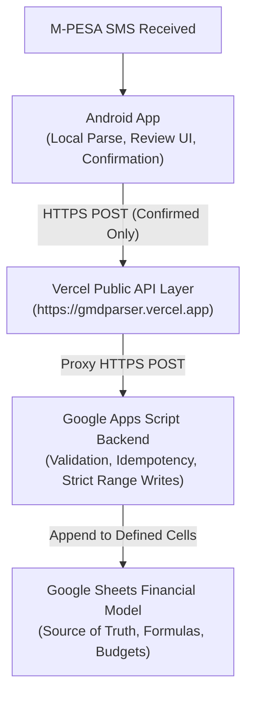

# GMDParser

> Intelligent Kenyan Personal Finance Management Operating System built around M-PESA transaction data.

---

## 1. Overview & Clean-Slate Philosophy

**GMDParser** is not a simple SMS parser. It is a personal financial operating system whose primary data capture mechanism is Android-based M-PESA SMS detection.

This repository is built completely from the ground up under a **clean-slate architecture**:
* No legacy code restoration or deprecated dependencies.
* Clear, strict separation of concerns across mobile, network proxy, serverless backend, and spreadsheet layers.
* **Google Sheets is the authoritative financial source of truth.**
* **Android requires explicit user confirmation** before any transaction is committed (`isAutoSync = false`).
* **Apps Script enforces fail-closed server-side validation and idempotency.**
* **Vercel acts purely as a public HTTPS routing/proxy layer**, never as a database.

---

## 2. Core Architecture

The end-to-end data pipeline consists of four strictly decoupled layers:



1. **Android App (`android/`)**:
   - Captures incoming M-PESA SMS messages.
   - Deterministically parses transaction parameters (amount, date, code, parties, account, category).
   - Presents parsed interpretation to the user for review and manual correction.
   - Requires explicit user confirmation before network submission.
   - Never exposes backend secrets or directly mutates Google Sheets.

2. **Vercel Network Layer (`web/`)**:
   - Hosted at `https://gmdparser.vercel.app`.
   - Provides a stable, universally accessible public HTTPS gateway for the Android client.
   - Proxies authenticated API requests to the Google Apps Script Web App.
   - Stores no financial data.

3. **Google Apps Script Backend (`apps-script/`)**:
   - Secure execution engine bound to the financial spreadsheet.
   - Validates all transaction fields against spreadsheet taxonomy.
   - Enforces idempotency via transaction code duplicate checks.
   - Appends strictly to permitted column ranges (`C:D`, `G:H`, `J:L`), preserving formulas and data validation.

4. **Google Sheets Financial Model**:
   - The authoritative financial model and ledger.
   - Defines categories, accounts, budget balances, and financial reporting formulas.

---

## 3. Repository Structure

```text
/
├── .gitignore             # Root ignore (excludes IDE internals, tokens, build outputs)
├── README.md              # Project overview and directory map
├── ARCHITECTURE.md        # Deep architectural design and responsibility boundaries
├── DATA_MODEL.md          # Spreadsheet data contract and taxonomy mapping
├── API_CONTRACT.md        # Public and internal REST API specifications
├── SECURITY.md            # Security model, credentials isolation, fail-closed design
├── DEPLOYMENT.md          # Deployment runbooks for Vercel, Apps Script, and Android
├── TESTING.md             # Verification protocols and test matrices
├── android/               # Android native application (Kotlin / Gradle)
├── web/                   # Vercel serverless API proxy (Node.js)
├── apps-script/           # Google Apps Script backend code (Clasp managed)
├── docs/                  # Additional technical specifications and guides
└── tests/                 # Shared integration and contract tests
```

---

## 4. Phased Implementation Roadmap

* [ ] **Phase 1: Financial Model / Spreadsheet** – Inspect spreadsheet contract, column bounds, validation rules, category/account taxonomy.
* [ ] **Phase 2: Apps Script Backend** – Implement health check, duplicate check, validation, and safe row appending.
* [ ] **Phase 3: Vercel API Layer** – Build thin HTTPS proxy and contract tests targeting `https://gmdparser.vercel.app`.
* [ ] **Phase 4: Android Network Client** – Native HTTP client with configurable base URL and error resilience.
* [ ] **Phase 5: Android M-PESA Parser** – Local regex/grammar parser covering Kenyan transaction types with unit tests.
* [ ] **Phase 6: Full Integration** – End-to-end integration and user confirmation workflow.
* [ ] **Phase 7: Production Deployment** – Production verification against live financial spreadsheet.
